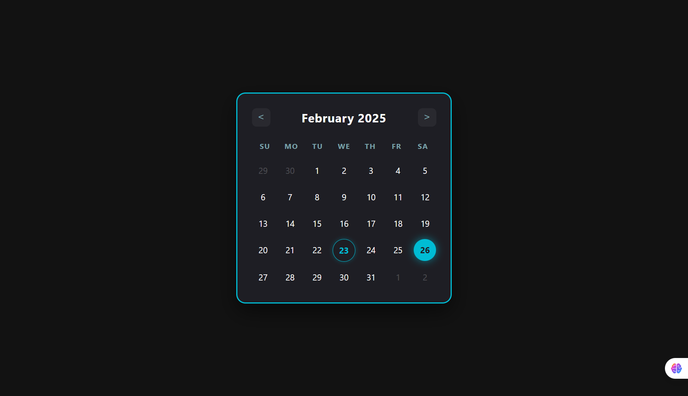

# Datepicker UI 📅

Solusi untuk tantangan [Datepicker UI](https://roadmap.sh/projects/datepicker-ui) dari [roadmap.sh](https://roadmap.sh).

Proyek ini adalah implementasi komponen antarmuka tanggal (Datepicker) statis yang berfokus pada teknik tata letak modern dan styling estetika.

## 📸 Tampilan Proyek

*(Pastikan file gambar Project-image.png ada di folder yang sama dengan README ini)*

## ✨ Fitur Utama

- **Modern Dark Mode**: Menggunakan palet warna gelap dengan aksen *Neon Cyan* (`#00bcd4`) yang elegan.
- **CSS Grid Layout**: Penataan tanggal yang presisi menggunakan `grid-template-columns`.
- **Micro-Interactions**:
  - **Entrance Animation**: Efek *slide-up* halus saat halaman dimuat.
  - **Hover Effects**: Efek *glow* dan pembesaran skala saat kursor diarahkan ke tanggal.
  - **Pulse Effect**: Animasi berdenyut pada tanggal yang dipilih (*selected state*).
- **Responsive Design**: Komponen terpusat dan responsif.
- **Clean Code**: Menggunakan **CSS Variables** (`:root`) untuk pengelolaan tema warna yang mudah.

## 🛠️ Teknologi yang Digunakan

* **HTML5**: Struktur semantik.
* **CSS3**:
    * Flexbox & Grid
    * CSS Variables (Custom Properties)
    * Keyframe Animations
    * Transitions

## 🚀 Cara Menjalankan

1.  Clone repositori ini atau unduh file `.zip`.
2.  Pastikan file `datepicker.html` dan gambar aset berada dalam satu folder.
3.  Buka file `datepicker.html` menggunakan browser web modern apa saja (Chrome, Firefox, Edge).

## 🎨 Palette Warna

| Variabel | Hex Code | Penggunaan |
| :--- | :--- | :--- |
| `--bg-body` | `#121212` | Latar Belakang Halaman |
| `--bg-card` | `#1e1e24` | Kartu Kalender |
| `--accent-color`| `#00bcd4` | Warna Utama (Highlight/Neon) |
| `--text-main` | `#ffffff` | Teks Utama |

## 🔗 Sumber Tantangan

Proyek ini dibuat berdasarkan spesifikasi dari:
**[https://roadmap.sh/projects/datepicker-ui](https://roadmap.sh/projects/datepicker-ui)**

---
*Dibuat untuk tujuan pembelajaran layouting dan styling CSS.*